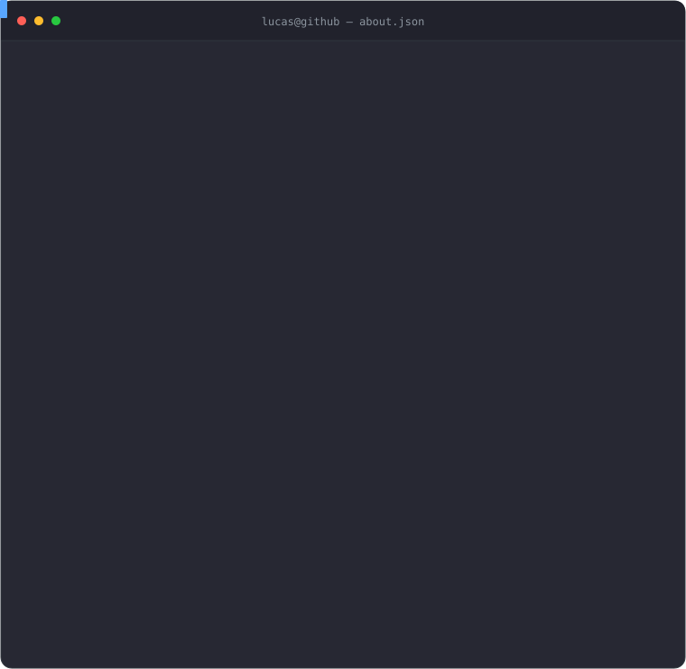

<h1>Software Developer | AI Engineer</h1>

Next.js · Python · AI Agents

<h2>🧭 Áreas de atuação</h2>

<table>
<tr>
<td width="33%" valign="top">

### 💻 Desenvolvimento de Software

Criação e evolução de aplicações, sistemas e serviços, com tecnologias adequadas a cada projeto.

`Aplicações` · `Sistemas` · `APIs`

</td>
<td width="33%" valign="top">

### 🤖 Inteligência Artificial

Exploração e desenvolvimento de soluções com IA, agentes e integração de modelos em aplicações.

`IA aplicada` · `Agentes` · `Integrações`

</td>
<td width="33%" valign="top">

### ⚙️ Integrações e Automação

Conexão entre ferramentas, dados e serviços para automatizar processos e ampliar funcionalidades.

`APIs` · `Dados` · `Automação`

</td>
</tr>
</table>

<h2>🛠️ Stack e ferramentas</h2>

<table>
<tr>
<td width="33%" align="center"> <h3>Next.js</h3></td>
<td width="33%" align="center"> <h3>TypeScript</h3></td>
<td width="33%" align="center"> <h3>Python</h3></td>
</tr>
</table>

Ferramentas que uso em projetos e estudos.

<table>
<tr>
<td width="190"><b>🔤 Linguagens</b></td>
<td>

</td>
</tr>
<tr>
<td width="190"><b>🎨 Front-end</b></td>
<td>

</td>
</tr>
<tr>
<td width="190"><b>⚙️ Back-end e APIs</b></td>
<td>

</td>
</tr>
<tr>
<td width="190"><b>🗄️ Banco de dados</b></td>
<td>

</td>
</tr>
<tr>
<td width="190"><b>🧠 IA</b></td>
<td>

</td>
</tr>
<tr>
<td width="190"><b>🤖 Agentes de IA</b></td>
<td>

</td>
</tr>
<tr>
<td width="190"><b>📱 Mobile e desktop</b></td>
<td>

</td>
</tr>
<tr>
<td width="190"><b>🧪 Testes</b></td>
<td>

</td>
</tr>
<tr>
<td width="190"><b>🔧 Ambiente</b></td>
<td>

</td>
</tr>
</table>

<h2>🌱 Estudos</h2>

<table>
<tr>
<td width="33%" valign="top">

#### 🚀 Construindo

Projeto próprio de software, com atenção à experiência de uso.

`Software` · `Usabilidade`

</td>
<td width="33%" valign="top">

#### 🎓 Aprofundando

Estudos em IA por meio de disciplina no Cin da UFPE.

`Inteligência artificial` · `Estudo`

</td>
<td width="33%" valign="top">

#### 🤖 Explorando

Supervisão, organização e revisão de desenvolvimento com múltiplos agentes.

`Agentic Workflows` · `Revisão`

</td>
</tr>
</table>

<h2>📊 Estatísticas e atividade</h2>

### 🔥 Streak Stats

### 💻 GitHub Profile Stats

  
  

Dados atualizados diariamente. Linguagens representam bytes de código público, não nível de experiência. Commits, PRs e issues consideram os últimos 12 meses.

### ⚡ Atividade pública

<h2>🔎 Open Source</h2>

<table>
<tr>
<td width="60%" valign="top">

### 🧅 [OpenCebola](https://github.com/LucasDpaulo/OpenCebola)

Interface de código aberto para o **Stremio**. Rode no seu computador ou hospede a sua própria versão, usando sua conta e seus addons.

</td>
<td width="40%" valign="top">

#### ✨ O que já tem

- 👤 Perfis
- 📚 Biblioteca
- ⏯️ Continuar de onde parou
- 📖 Guia de instalação

</td>
</tr>
<tr>
<td colspan="2" align="center">

&nbsp;

&nbsp;&nbsp;

</td>
</tr>
</table>

<h2>🤝 Vamos conversar</h2>

Para conversar sobre desenvolvimento de software, agentes de IA ou projetos:

<!-- PORTFOLIO: Replace PORTFOLIO_URL and uncomment when the website is available.

-->

